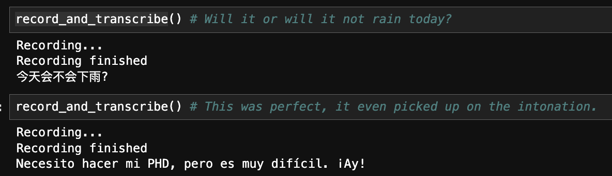

# OpenAI Jupyter Notebook Wrapper

AutoMetaD (Processing MetaData Automatically) is an LLM-based tool presented in the form of a jupyter notebook that allows users to easily clean and summarize metadata with support for attributes commonly relevant to microbiome studies. Users can interact with an LLM within a jupyter notebook in ways that automatically provide context to queries based on the loaded metadata file. Summarizing a table and visualizing columns and intersections of columns have been automated, along with specific functions for anomaly detection and column name correcting. 


## Installation

To use this notebook, clone the repository and create a new conda environment:

```bash
git clone https://github.com/dpear/metagpt.git
cd metagpt
conda create env -n metagpt -f environment.yml
```

If you wish to use within an existing conda environment:
```bash
conda env update --name existing_env --file environment.yml
```

Then, activate the environment to add a jupyter notebook kernel:
```bash
conda activate metagpt
python -m ipykernel install --user --name metagpt --display-name "metagpt"
```

## Using the Notebook

First activate the environment, then actiate the jupyter notebook server (please note that you must activate the environment before starting the jupyter notebook server):
```bash
conda activate metagpt
jupyter notebook
```
Then navigate to the `proof_of_concept_template_ai_memorializing_DP.ipynb` notebook and run to see an example of the different supported summarization and cleaning functions.

## Multilingual Voice Recognition


## How to Obtain an API Key from OpenAI

To use OpenAI's API with this project, you will need an API key. Follow these steps to obtain your key:

#### Step 1: Sign Up or Log In
1. Go to the [OpenAI website](https://platform.openai.com/).
2. Click **Sign Up** to create an account or **Log In** if you already have one.

#### Step 2: Access the API Key Page
1. After logging in, navigate to the [API Keys page](https://platform.openai.com/account/api-keys).
2. This is where you can manage your API keys.

#### Step 3: Generate a New API Key
1. Click the **+ Create new secret key** button.
2. A new API key will be displayed. **Copy it immediately**, as it will not be shown again.
   - If you lose it, you’ll need to create a new key.

#### Step 4: Secure Your API Key
- **Do not share your API key publicly.**
- Use environment variables or a configuration file to manage your key securely.

#### Troubleshooting:
- If you encounter problems with your API key, it may require setting up an account that has a paid subscription plan. 
- Please see the [OpenAI website](https://platform.openai.com/) for more details.
